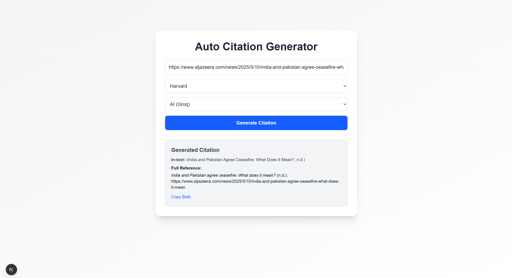

# 📚 Citation Generator

Automatically generate academic citations from any article URL in multiple formats — including Harvard, APA, MLA, and Chicago. Powered by Citation.js, HTML scraping, and AI via Groq’s LLaMA 3.

---

## ✨ Features

- 🔗 Paste any article URL
- 📘 Choose citation style: **APA 7, Harvard, MLA 9, Chicago**
- 🧠 Choose metadata extraction method:
  - **Citation.js** (best for DOIs)
  - **HTML scraping** (quick fallback)
  - **AI-powered** (via Groq — works for almost anything)
- 📝 Outputs:
  - **In-text citation**
  - **Full reference citation (with italics)**

---

## 🔧 How It Works

This project is built with:

- **Frontend**: Next.js + Tailwind CSS
- **Backend**: Express.js + Citation.js
- **AI Fallback**: Groq's LLaMA 3 via OpenAI-compatible API
- **Deployment**: Vercel (frontend) & Render (backend)

---

## 🚀 Getting Started

### 1. Clone the repo

```bash
git clone https://github.com/YOUR_USERNAME/citationgenerator.git
cd citationgenerator
```
### 2. Install backend dependencies
```bash
npm install
```
Create a .env file and add:
```bash
GROQ_API_KEY=your_groq_key_here
PORT=4000
```
### 3. Install frontend (in /web)
```bash
cd web
npm install
```
Add a .env.local file:
```bash
NEXT_PUBLIC_API_BASE=http://localhost:4000
```
### 4. Run locally
```bash
# In one terminal
npm run dev         # for backend
# In another terminal
cd web
npm run dev         # for frontend
```

## 🧠 How Citation Extraction Works
Citation-JS: Works on DOI/ISBN/URL

HTML Scraping: Extracts title, author, and publish date from metadata

Groq AI (LLaMA 3): Uses AI to understand raw HTML and extract citation metadata

The user can select which method to use — or default to "Auto" (tries all).

###📷 Screenshots

## 📜 License
MIT © EMERSON

emersonhoo123@gmail.com


